# 🛡️ Projet personnel – Honeypot Hybride

## 🎯 Objectif

Concevoir un honeypot hybride exposé sur Internet, capable d’attirer les attaquants via une fausse interface web et de détecter automatiquement différents types d’attaques réseau ou applicatives.

## 🛠 Outils utilisés

- **Python (Flask)** : développement du serveur web interactif  
- **SQLite** : base de données locale pour stocker les logs d’attaque  
- **Matplotlib** : génération automatique de graphiques statistiques  
- **NumPy** : gestion des valeurs numériques pour les visualisations  
- **GeoLite2 (geoip2)** : géolocalisation des IP et résolution ASN  
- **Counter & defaultdict** : comptage et traitement structuré des données  
- **Jinja2 (via Flask)** : création de pages HTML dynamiques côté admin  
- **VPS Hostinger** : hébergement du honeypot accessible publiquement

## 🚧 Réalisation

Mise en place d’un faux site d’administration (`/admin`, `/users`, etc.) détectant automatiquement les tentatives de brute force, injections SQL/XSS, scans, DDoS…  
Tous les événements sont enregistrés dans une base de données, puis visualisés localement via deux interfaces :
- `visualisation.html` → page de graphiques
- `details.html` → page de logs

---

## 📊 Page visualisation (monitoring)

### 🧠 Résumé d’activité généré dynamiquement  
Cette section présente une synthèse automatique des attaques enregistrées : volume global, types d’attaques, pays d’origine, endpoints ciblés, IPs les plus actives, et ports scannés. En bas, un graphique en camembert met en évidence les pays les plus impliqués.

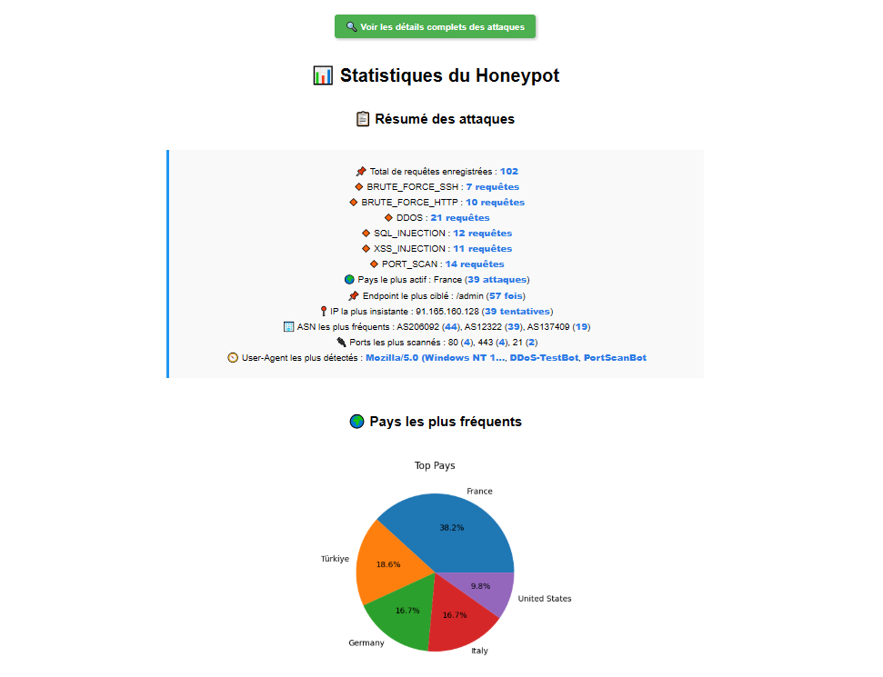

---

### 🗂 Pages visitées et ASN les plus fréquents  
Le premier graphique affiche les endpoints les plus ciblés par les attaquants (notamment `/admin`). La répartition GET/POST permet d’identifier les tentatives de connexion ou de scan. Le second graphique montre les ASN (fournisseurs de connectivité) les plus représentés parmi les IP détectées.

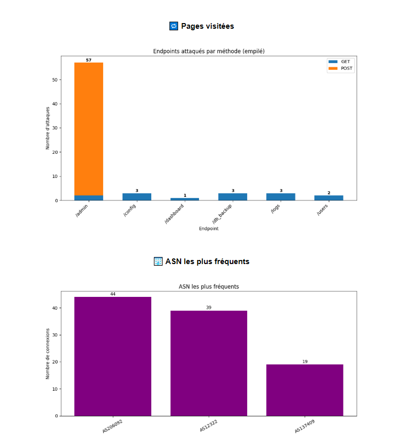

---

### 🔁 Top IPs les plus insistantes et attaques détectées  
Ce graphique met en évidence les adresses IP ayant généré le plus de requêtes vers le honeypot, illustrant des comportements suspects. En dessous, les types d'attaques détectés sont classés par fréquence, allant du brute force SSH aux scans de port, en passant par les attaques DDoS et les injections SQL/XSS.

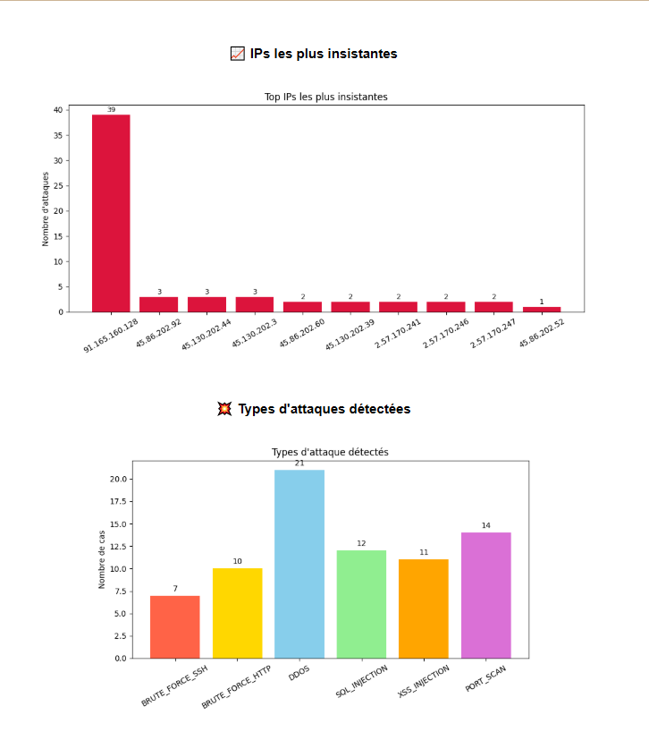

---

### 📡 User-Agent et ports les plus ciblés  
Les premiers graphiques révèlent les outils ou navigateurs utilisés par les attaquants, souvent des scripts automatisés. Le second graphique présente les ports les plus souvent scannés, illustrant les tentatives de reconnaissance réseau sur des services comme HTTP, HTTPS, FTP ou RDP.

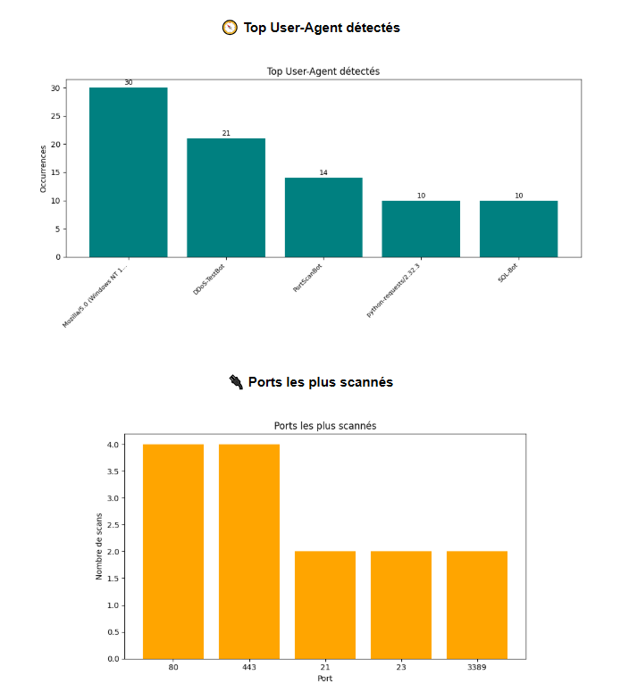

---

## 🗂️ Page details (monitoring)

### 🛠 Scans de ports identifiés par le honeypot  
Scans de ports identifiés par le honeypot avec type de service ciblé.

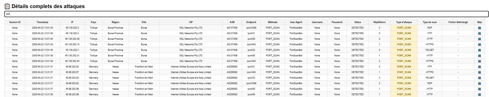

---

### 🧨 Logs d’attaques DDoS, brute force HTTP et SSH  
Logs retraçant des attaques DDoS, brute force HTTP et SSH.

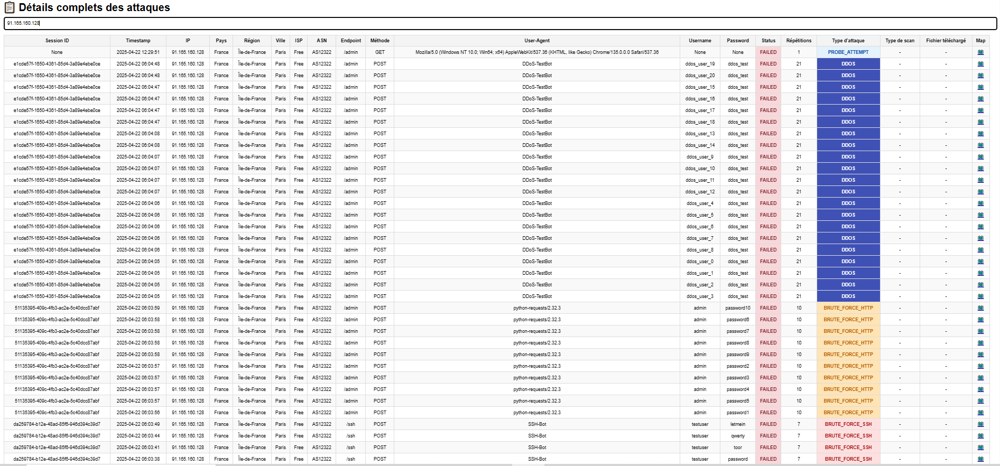

---

### 📥 Tentatives de téléchargement de fichiers sensibles  
Tentatives de téléchargement de fichiers sensibles via endpoints piégés.

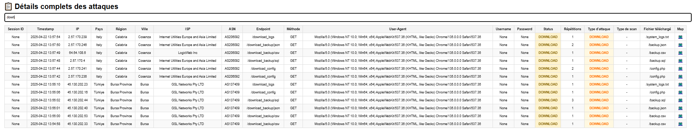

---

### 💉 Injections SQL et XSS détectées automatiquement  
Logs d’attaques par injection SQL et XSS détectées automatiquement.

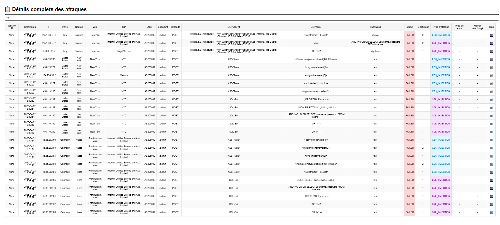

## 🕵️ Interface de simulation (honeypot web)

### 🔐 Fausse page de connexion à un espace d’administration  
Permet de récupérer les identifiants saisis par l’attaquant.  
Conçue pour simuler un accès restreint crédible aux yeux d’un intrus.

---

### 📊 Tableau de bord fictif affichant plusieurs accès critiques  
Chaque module redirige vers une autre interface piégée.  
L’illusion d’un vrai panneau admin renforce l’engagement de l’attaquant.

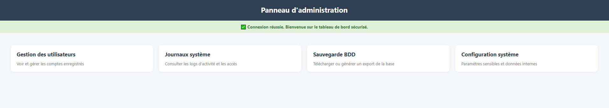

---

### 🗃️ Interface simulant l’accès à des sauvegardes de base de données  
Les fichiers affichés (SQL, CSV, JSON) semblent téléchargeables.  
Chaque clic sur "Télécharger" est capturé pour analyse.

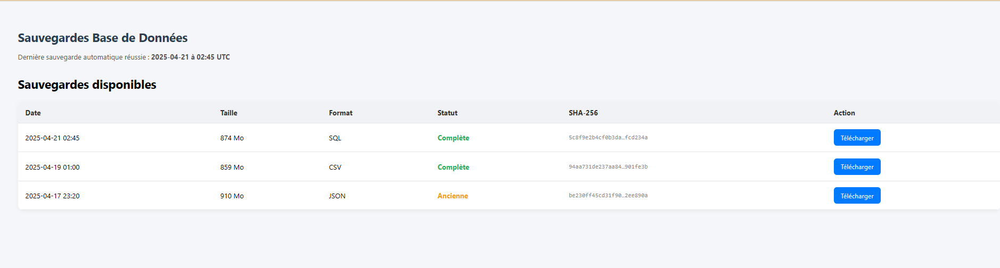

---

### 📄 Faux journal système listant des événements crédibles  
Les actions sont inventées mais crédibles (téléchargements, échecs SSH…).  
Chaque affichage simule une vraie infrastructure active. Les logs sont téléchargeables.

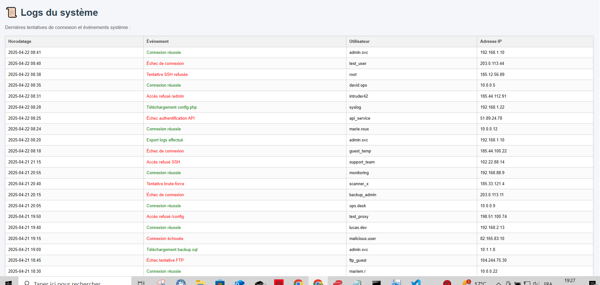

---

### 👤 Liste fictive d’utilisateurs avec rôles et privilèges  
Les intitulés sont volontairement provocateurs (`root_access`, `ceo_panel`…).  
Objectif : inciter à l’exploration ou au vol d’identité.

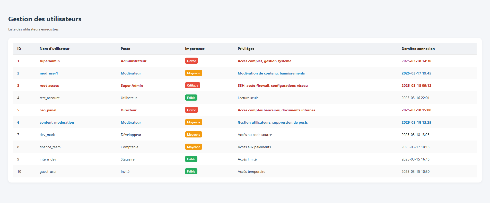

---

### ⚙️ Page simulée d’accès à un fichier de configuration (`config.php`)  
Elle contient des données fictives censées sembler confidentielles.  
Utilisée pour piéger les attaquants à la recherche d’APIs ou d’identifiants.

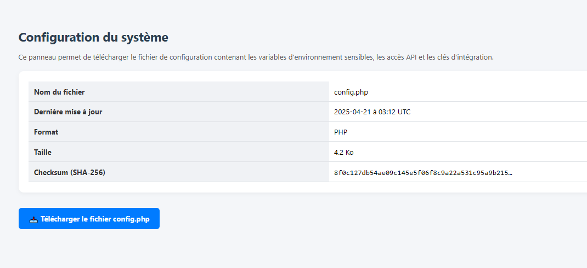

---

## 💻 Scripts & fichiers du projet

### 🧩 `app.py`
Serveur Flask utilisé en production, déployé sur le VPS. Il simule des pages vulnérables (`/admin`, `/config`, etc.) et enregistre toutes les requêtes dans `honeypot.db`.

### 📊 `app_local.py`
Version locale permettant à l’administrateur de visualiser les statistiques des attaques à travers `visualisation.html` et `details.html`. Utilise `matplotlib`, `numpy`, `geoip2`...

### 🖥️ `visualisation.html` et `details.html`
Pages d’administration accessibles uniquement en local.  
- `visualisation.html` : affiche des graphiques statistiques générés à partir des logs  
- `details.html` : tableau dynamique des logs bruts

### 🎭 Exemples de templates piégés
- `admin.html` : fausse page de connexion
- `config.html` : fichier de configuration fictif
- `logs.html` : faux journaux d’activité

